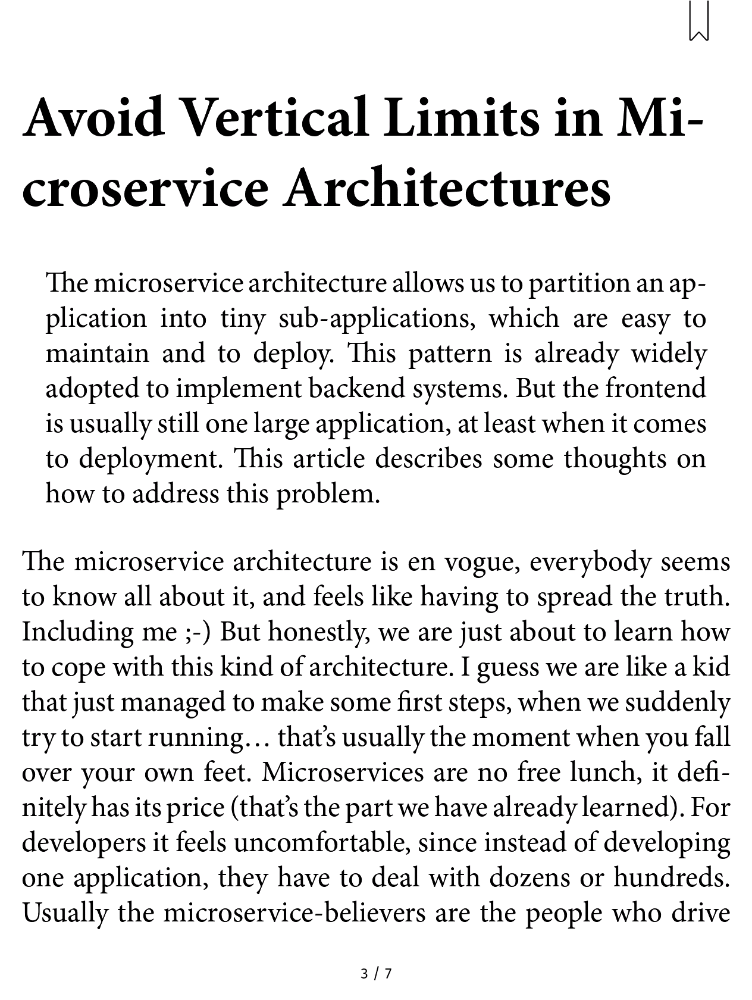
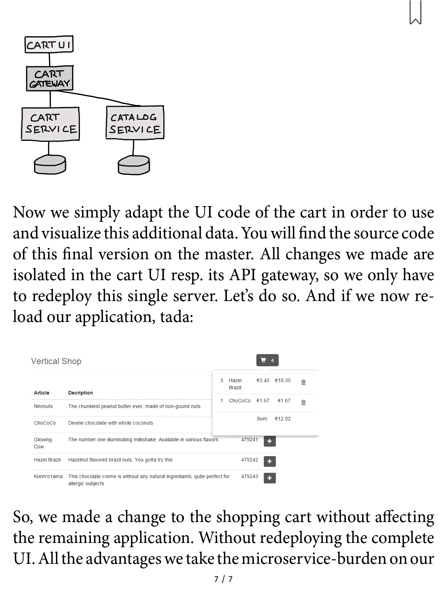

# ebook
This project uses github actions to convert some markdown to .epub and .mobi. As markdown content, an old article of mine is used, see https://github.com/ralfstuckert/vertical-ui/wiki. The output can be found in the [ebook workflow](https://github.com/ralfstuckert/ebook/suites/3206592798/artifacts/74153517)

Here are some screenshots from my tolino reader:

</img>
</img>

